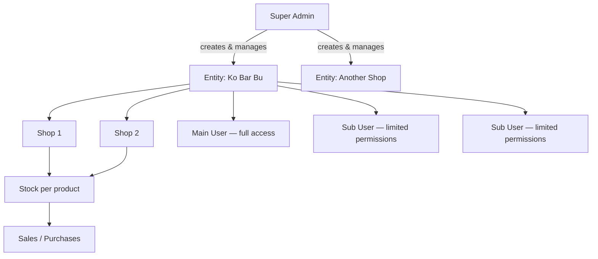
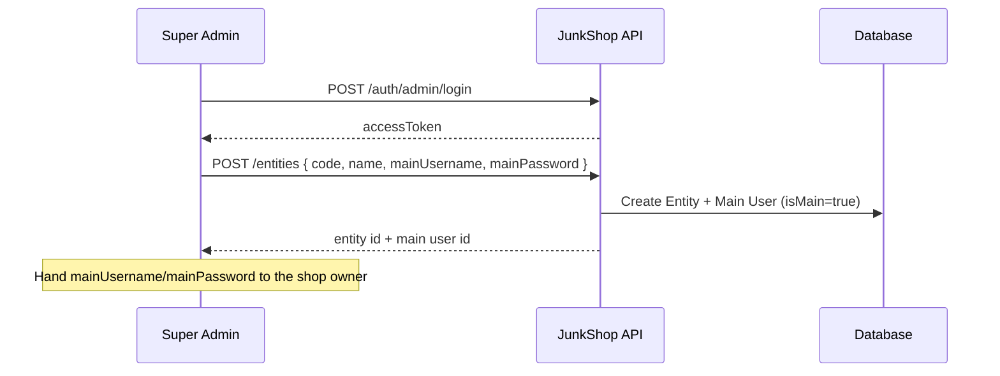
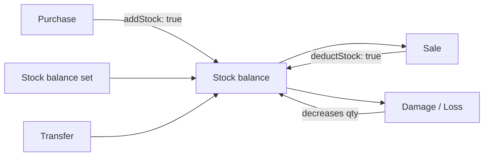

# JunkShop — User Roles & Application Flow

This document explains **who can do what** in the JunkShop backend, how users log in, and how data flows through the system for each role.

---

## 1. Big picture

JunkShop is a **multi-tenant** system:

- One **platform** (Super Admin) manages many **companies** (Entities).
- Each **Entity** is a junk/scrap shop business with its own shops, products, stock, sales, and staff.
- Staff log in under their company and only see **their company's data**.



---

## 2. The three roles

| Role | Who is it? | Login endpoint | Scope |
|------|------------|----------------|-------|
| **Super Admin** | Platform owner / system administrator | `POST /api/v1/auth/admin/login` | All entities |
| **Main User** | Company owner / primary account (`isMain: true`) | `POST /api/v1/auth/login` | One entity only |
| **Sub User** | Staff account with assigned permissions | `POST /api/v1/auth/login` | One entity only |

### Super Admin

- Stored in the `super_admins` table.
- Created automatically on **seed** (see `.env`: `SUPER_ADMIN_EMAIL`, `SUPER_ADMIN_PASSWORD`).
- Can **create, read, update, delete Entities** (companies).
- When creating an entity, also creates that entity's **main user** (`mainUsername` + `mainPassword`).
- Has **all permissions** on every route — no permission checks apply.
- Does **not** belong to any entity. For entity-scoped APIs (shops, products, stock, etc.) must pass **`?entityId=`** in the query string (or `entityId` in body/params).

### Main User (entity owner)

- First login account for each entity (`isMain: true`).
- Created when Super Admin creates an entity, or by seed for the demo entity **Ko Bar Bu**.
- **Automatically has every permission** — same power as full admin *within that entity*.
- Cannot be deleted.
- Cannot have permissions edited (already has all).
- Logs in with: `{ entityCode, username, password }`.

### Sub User (staff)

- Extra accounts created by someone with `user.manage` permission (usually the main user).
- Gets a **custom list of permissions** (e.g. only view products, manage sales).
- Locked to **one entity** — cannot see other companies' data.
- Can be deactivated or deleted (except main user).
- Logs in with the same endpoint as main user: `{ entityCode, username, password }`.

---

## 3. How login works

### Super Admin login

```http
POST /api/v1/auth/admin/login
Content-Type: application/json

{
  "email": "admin@junkshop.local",
  "password": "Admin@12345"
}
```

**Response** includes `accessToken`, `refreshToken`, and user info with `role: "SUPER_ADMIN"`.

### Entity user login (main or sub)

```http
POST /api/v1/auth/login
Content-Type: application/json

{
  "entityCode": "KBB",
  "username": "admin",
  "password": "Admin@12345"
}
```

**Response** includes tokens and user info with `role: "SUB_USER"`, plus `entityId`, `entityCode`, and `isMain`.

### Using the API after login

Send the access token on every protected request:

```http
Authorization: Bearer <accessToken>
```

| Endpoint | Purpose |
|----------|---------|
| `GET /api/v1/auth/me` | See current user, role, and permissions |
| `POST /api/v1/auth/refresh` | Get new tokens using `refreshToken` |

**Token lifetime** (defaults): access token 15 minutes, refresh token 7 days.

---

## 4. Entity scoping — who sees what data?

All business data (shops, products, stock, sales, etc.) belongs to an **Entity**.

| Actor | How entity is chosen |
|-------|----------------------|
| **Sub User / Main User** | Automatic — always their own `entityId` from the token |
| **Super Admin** | Must specify `?entityId=1` (query), or `entityId` in body/params |

If Super Admin calls `/shops` without `entityId`, the API returns:

```json
{ "success": false, "message": "Super admin must specify entityId" }
```

**Example (Super Admin listing shops for entity 1):**

```http
GET /api/v1/shops?entityId=1&page=1&pageSize=20
Authorization: Bearer <super-admin-token>
```

---

## 5. Permission system

Sub users (non-main) need explicit **permission keys**. Main user and Super Admin **bypass** all permission checks.

Permissions are defined in `src/constants/permissions.ts`:

| Area | View permission | Manage permission |
|------|-----------------|-------------------|
| Shops | `shop.view` | `shop.manage` |
| Users | `user.view` | `user.manage` |
| Categories | `category.view` | `category.manage` |
| Products | `product.view` | `product.manage` |
| Stock | `stock.view` | `stock.manage` |
| Stock transfer | — | `stock.transfer` |
| Customers | `customer.view` | `customer.manage` |
| Suppliers | `supplier.view` | `supplier.manage` |
| Sales | `sale.view` | `sale.manage` |
| Purchases | `purchase.view` | `purchase.manage` |
| Reports | `report.view` | — |
| Settings (units/banks) | `setting.view` | `setting.manage` |

**Examples:**

- A cashier might get: `sale.view`, `sale.manage`, `product.view`, `customer.view`
- A warehouse staff might get: `stock.view`, `stock.manage`, `stock.transfer`, `product.view`
- A read-only manager might get: all `*.view` permissions + `report.view`

Assign permissions when creating a user or via:

```http
PUT /api/v1/users/:id/permissions
{ "permissions": ["product.view", "sale.manage"] }
```

List all available keys:

```http
GET /api/v1/users/permissions
```

---

## 6. What each role can access

### Route access matrix

| API area | Super Admin | Main User | Sub User |
|----------|:-----------:|:---------:|:--------:|
| `/entities` (CRUD) | ✅ | ❌ | ❌ |
| `/shops` | ✅* | ✅† | ✅† |
| `/users` | ✅* | ✅† | ✅† |
| `/categories`, `/products` | ✅* | ✅† | ✅† |
| `/customers`, `/suppliers` | ✅* | ✅† | ✅† |
| `/stock` | ✅* | ✅† | ✅† |
| `/sales`, `/purchases` | ✅* | ✅† | ✅† |
| `/reports` | ✅* | ✅† | ✅† |
| `/settings` | ✅* | ✅† | ✅† |

\* Super Admin must pass `entityId` on entity-scoped routes.  
† Requires the matching permission key (main user has all).

---

## 7. Role playbooks — typical workflows

### A. Super Admin — onboard a new company



**Steps:**

1. Log in as Super Admin.
2. `POST /entities` with company details + `mainUsername` / `mainPassword`.
3. Share entity **code** and main credentials with the shop owner.
4. Optionally log in as Super Admin with `?entityId=` to inspect or help configure their data.

**Super Admin does NOT usually:**

- Run daily sales or stock for a shop (that's entity staff's job).
- Delete entities unless offboarding a customer.

---

### B. Main User — set up and run the business

The main user is the **company administrator**. After login with `entityCode` + username:

**One-time setup:**

1. **Shops** — create branches (`POST /shops`).
2. **Settings** — add units (kg, piece) and bank accounts (`POST /settings/units`, `/settings/banks`).
3. **Categories & products** — define inventory (`POST /categories`, `POST /products`).
4. **Staff** — create sub users with limited permissions (`POST /users`).
5. **Opening stock** — set initial quantities (`POST /stock/balance`).

**Daily operations:**

| Task | Endpoint | Permission needed |
|------|----------|-------------------|
| Record purchase (stock in) | `POST /purchases` | `purchase.manage` |
| Record sale (stock out) | `POST /sales` | `sale.manage` |
| Damage / loss | `POST /stock/damage`, `/stock/loss` | `stock.manage` |
| Move stock between shops | `POST /stock/transfer` | `stock.transfer` |
| View reports | `GET /reports/sales/by-product` etc. | `report.view` |

**Main user powers only:**

- Full access without assigning permissions.
- Can create/edit/delete sub users and set their permissions.
- Cannot delete themselves (main account is protected).

---

### C. Sub User — day-to-day staff

Sub users see **only their entity** and **only what their permissions allow**.

**Example: Cashier (`sale.view`, `sale.manage`, `product.view`, `customer.view`)**

1. Log in with `entityCode` + username.
2. Look up products: `GET /products`.
3. Create a sale: `POST /sales` with shop, items, invoice number.
4. Stock is reduced automatically (unless `deductStock: false`).

**Example: Warehouse staff (`stock.view`, `stock.manage`, `stock.transfer`)**

1. Check balances: `GET /stock?shopId=1`.
2. Record damage: `POST /stock/damage`.
3. Transfer between shops: `POST /stock/transfer`.

**What sub users cannot do (unless granted):**

- Create entities or other companies' data.
- Manage users without `user.manage`.
- View reports without `report.view`.
- Access Super Admin routes.

If they try, the API returns **403 Forbidden — Insufficient permissions**.

---

## 8. Business data flow (stock & money)

Understanding how inventory moves helps every role:



| Action | Effect on stock | Ledger entry |
|--------|-----------------|--------------|
| **Purchase** | Increases (default) | `PURCHASE` |
| **Sale** | Decreases (default) | `SALE` |
| **Damage / Loss** | Decreases | `DAMAGE` / `LOSS` |
| **Balance update** | Sets absolute qty | `ADJUSTMENT` |
| **Transfer** | Out from shop A, in to shop B | `TRANSFER_OUT` / `TRANSFER_IN` |

Stock **cannot go negative** — operations fail with "Insufficient stock" if quantity would drop below zero.

Every change is recorded in **StockTransaction** (immutable ledger). Current on-hand qty lives in **Stock** per `(shop, product)`.

---

## 9. Demo accounts (from seed)

After `npm run seed` or Docker startup, these accounts exist:

| Role | How to log in | Password |
|------|---------------|----------|
| Super Admin | `POST /auth/admin/login` — email `admin@junkshop.local` | `Admin@12345` |
| Main User (Ko Bar Bu) | `POST /auth/login` — entity `KBB`, user `admin` | `Admin@12345` |

Demo entity **Ko Bar Bu** (`code: KBB`) includes:

- **Shop 1** (`KBB-S1`)
- **Shop 2** (`KBB-S2`)
- Main user `admin` with full permissions

Use the Postman collection in `postman/` to try these flows.

---

## 10. Quick reference — decision tree

```
Who are you?
│
├─ Platform operator?
│   └─ Super Admin login → manage /entities only directly
│      For shop data → add ?entityId= to every request
│
└─ Shop staff?
    └─ Entity login (entityCode + username)
        │
        ├─ isMain = true  → full power inside your company
        │
        └─ isMain = false → check your permission list (GET /auth/me)
            ├─ Has permission → allowed
            └─ Missing permission → 403 Forbidden
```

---

## 11. Related files in the codebase

| Topic | Location |
|-------|----------|
| Permission keys | `src/constants/permissions.ts` |
| Auth middleware | `src/middleware/auth.ts` |
| Permission checks | `src/middleware/authorize.ts` |
| Entity scoping | `src/utils/scope.ts` |
| Login handlers | `src/modules/auth/auth.controller.ts` |
| Entity creation | `src/modules/entity/entity.controller.ts` |
| User & permissions | `src/modules/user/user.controller.ts` |
| Seed data | `prisma/seed.ts` |
| Postman collection | `postman/JunkShop-API.postman_collection.json` |

---

## 12. Summary

| Role | Login | Manages companies | Manages shop data | Permissions |
|------|-------|-------------------|-------------------|-------------|
| **Super Admin** | Email + password | ✅ All entities | ✅ With `entityId` | All (implicit) |
| **Main User** | Entity code + username | ❌ | ✅ Own entity only | All (implicit) |
| **Sub User** | Entity code + username | ❌ | ✅ Own entity only | Assigned list only |

The system is designed so **one Super Admin** runs the platform, **one Main User per company** runs that business, and **Sub Users** handle specific jobs with least-privilege access.
